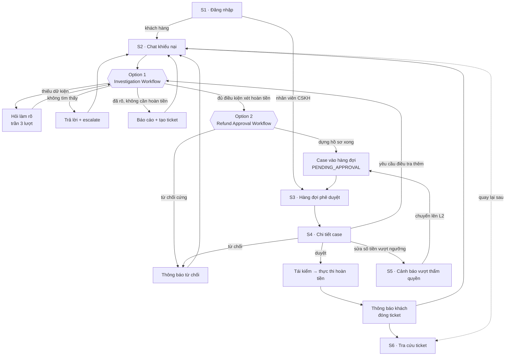
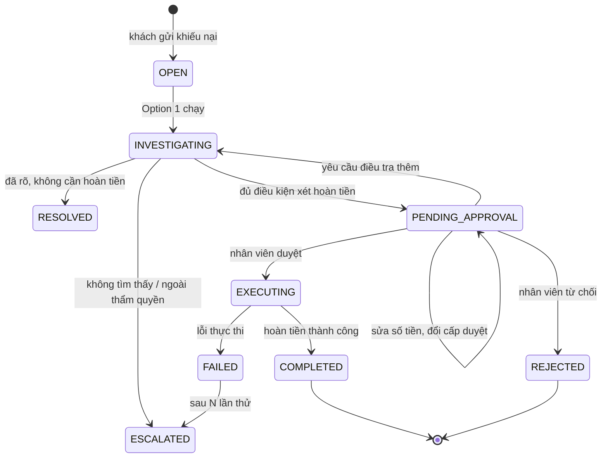

# UI Flow — AI Agent CSKH Ví điện tử & Xử lý Khiếu nại Giao dịch

| | |
|---|---|
| **Mã đề tài** | FIN-05 |
| **Nhóm** | `T240` |
| **Gate** | G1 — Chốt đề tài |
| **Ngày** | 02/08/2026 |
| **Tài liệu liên quan** | `brief.md`, `prd.md`, `wireframe.html` |

---

## 1. Danh mục màn hình

| Mã | Màn hình | Vai trò | Yêu cầu liên quan |
|---|---|---|---|
| S1 | Đăng nhập & chọn vai trò | Cả hai | `FR-A1` `FR-A2` |
| S2 | Chat khiếu nại | Khách hàng | `FR-B1` `FR-B2` `FR-B3` `FR-C2` `FR-C4` `FR-C10` |
| S3 | Hàng đợi phê duyệt | CSKH | `FR-E1` `FR-E4` `FR-D4` `FR-D11` |
| S4 | Chi tiết case & hồ sơ đề xuất | CSKH | `FR-E2` `FR-E3` `FR-E5` `FR-D5` `FR-D7` `FR-I3` |
| S5 | Trạng thái vượt thẩm quyền | CSKH | `FR-D4` `FR-D7` |
| S6 | Tra cứu ticket | Khách hàng | `FR-B3` `FR-B5` `FR-F2` `FR-F3` |

---

## 2. Luồng chuyển màn hình

**Ba điểm đáng chú ý trong sơ đồ**

1. Không có cạnh nào đi từ `W2` thẳng tới `EX`. Mọi đường tới thực thi hoàn tiền đều phải qua `S4` — đây là HITL được bảo đảm ở tầng luồng, không phải ở tầng lời nhắc.
2. `S4 → W1` (yêu cầu điều tra thêm) là đường quay lại duy nhất. Option 2 không tự tra cứu bổ sung.
3. `S5` không phải màn hình độc lập mà là trạng thái chặn của `S4`, luôn kết thúc bằng việc trả case về hàng đợi ở cấp cao hơn.

---

## 3. Trạng thái case và màn hình tương ứng

| Trạng thái | Khách thấy ở | Nhân viên thấy ở |
|---|---|---|
| `OPEN` `INVESTIGATING` | S2 (tiến trình theo bước) | — |
| `PENDING_APPROVAL` | S2 / S6 ("đang xem xét") | S3, S4 |
| `EXECUTING` `COMPLETED` | S2 / S6 + thông báo | S3 (đã xử lý) |
| `REJECTED` | S2 / S6 + lý do | S3 (đã xử lý) |
| `ESCALATED` `FAILED` | S6 ("đang xử lý bởi chuyên viên") | S3 (hàng đợi cấp cao) |

Khách không bao giờ nhìn thấy tên trạng thái kỹ thuật. Mỗi trạng thái ánh xạ sang một câu mô tả bằng ngôn ngữ thường.

---

## 4. Nguyên tắc thiết kế giao diện

**Tiến trình phải nhìn thấy được.** Khi Option 1 đang chạy, S2 hiển thị từng bước đã hoàn tất thay vì một chỉ báo đang tải. Điều tra mất vài giây, và người đang lo mất tiền cần biết hệ thống thực sự đang làm gì.

**Người duyệt nhận hồ sơ, không nhận dữ liệu thô.** S4 sắp xếp theo trình tự ra quyết định: kết luận trước, bằng chứng sau, rồi căn cứ chính sách, rồi phản chứng, cuối cùng mới tới đề xuất và nút bấm. Mục phản chứng đứng ngay trên hàng nút là có chủ đích — nó là thứ cuối cùng người duyệt đọc trước khi bấm.

**Ràng buộc hiện ra ở chỗ người dùng chạm vào.** Vượt thẩm quyền không được ẩn đi rồi báo lỗi sau khi bấm. S3 làm mờ case ngoài thẩm quyền, S5 chặn ngay lúc sửa số tiền và nói rõ chuyện gì sẽ xảy ra tiếp theo.

**Không dùng màu để mang thông tin sống còn.** Độ tin cậy, hạn SLA, cấp thẩm quyền đều hiển thị bằng chữ và số. Màu chỉ hỗ trợ, không thay thế.

---

## 5. Khung màn hình

Xem `wireframe.html` (mở bằng trình duyệt) hoặc ảnh chụp trong `screens/`.

| Tệp | Nội dung |
|---|---|
| `wireframe.html` | 6 khung màn hình kèm lớp chú thích trỏ về mã yêu cầu trong `prd.md` |
| `screens/s1_dang_nhap.png` … `screens/s6_tra_cuu_ticket.png` | Ảnh chụp từng màn |

---

## 6. Chưa quyết

1. S2 có cần hiển thị nút "Tạo yêu cầu hoàn tiền" cho khách chủ động bấm, hay chỉ để agent đề nghị?
2. S3 có cần chế độ xem theo khách hàng (gộp nhiều case của cùng một người) không?
3. Thông báo cho khách ở `FR-B5` đi qua kênh nào — chỉ trong ứng dụng, hay có cả email/SMS?